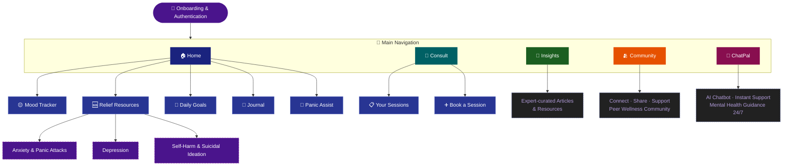
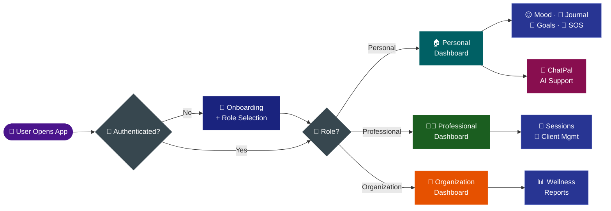

<div align="center">


[](https://git.io/typing-svg)

<br/>

[](https://flutter.dev)
[](https://firebase.google.com)
[](https://ai.google.dev)
[](https://hivedb.dev)
[](LICENSE)

> *Accessible, secure, and empathetic mental health support — for individuals, professionals, and organizations* 💜

</div>

---

## 📋 Table of Contents

<div align="center">

| | | |
|:---:|:---:|:---:|
| [🧠 Overview](#-overview) | [✨ Features](#-core-features) | [🗺️ App Architecture](#%EF%B8%8F-app-architecture) |
| [🔄 App Flow](#-app-flow) | [🛠️ Tech Stack](#%EF%B8%8F-tech-stack) | [📸 Screenshots](#-screenshots) |
| [🚀 Getting Started](#-getting-started) | [🛡️ Security](#%EF%B8%8F-security--environment) | [🚧 Roadmap](#-features-in-progress) |
| [📂 Folder Structure](#-folder-structure) | [👥 Team](#-team-ctrl-freaks) | [🙏 Acknowledgments](#-acknowledgments) |

</div>

---

## 🧠 Overview

**MindSarthi** is a mobile-first mental wellness platform built to deliver **accessible, secure, and empathetic support** to individuals, mental health professionals, and organizations.

<div align="center">

| 👤 Personal Users | 👨‍⚕️ Professionals | 🏢 Organizations |
|:---:|:---:|:---:|
| Daily wellness tools | Session management | Anonymized reports |
| AI emotional support | Client consultations | Team wellness dashboards |
| Panic SOS system | Verified profiles | Role-based access |

</div>

---

## ✨ Core Features

<div align="center">

| Feature | Description |
|:---:|:---|
| 🔐 **Role-based Onboarding** | Separate flows for Personal, Professional & Organization users |
| 😌 **Mood Tracker** | Log and visualize your daily emotional state |
| 📓 **Journaling** | Encrypted local journaling via Hive |
| 🎯 **Daily Goals** | Set and track small wellness milestones |
| 🚨 **Panic SOS Button** | Trigger emergency flow + mock connect — *Unique Safety USP* |
| 🤖 **ChatPal** | AI-powered chatbot for instant mental health guidance |
| 📅 **Consult** | Book & manage therapy sessions with verified professionals |
| 📰 **Insights** | Expert-curated mental health articles & resources |
| 🫂 **Community** | Peer support space — share, connect, uplift |

</div>

---

## 🗺️ App Architecture



---

## 🔄 App Flow



---

## 🛠️ Tech Stack

<div align="center">

| Layer | Technology | Purpose |
|:---:|:---:|:---|
| 📱 Frontend |  | Cross-platform Android/iOS app |
| 🔥 Backend |  | Auth, Firestore DB, real-time sync |
| 💾 Local Storage |  | Encrypted journaling & offline data |
| 🤖 AI / NLP |  | ChatPal AI responses *(planned)* |
| 🎨 Design |  | UI/UX design & prototyping |
| 💬 Language |  | App development language |

</div>

---

## 📸 Screenshots

<div align="center">


</div>

---

## 🚀 Getting Started

### Prerequisites

```
✅ Flutter 3.x SDK
✅ Dart SDK
✅ Firebase project (Firestore + Auth enabled)
✅ Gemini API key  →  https://ai.google.dev
```

### Setup

**1️⃣ Clone the repository**
```bash
git clone https://github.com/TeamCtrlFreaks/MindSarthi
cd MindSarthi
```

**2️⃣ Install dependencies**
```bash
dart pub get
```

**3️⃣ Configure Firebase**
```bash
flutterfire configure
```

**4️⃣ Add Gemini API key**

Create `lib/services/gemini_api_key.dart` and add your key:
```dart
const String geminiApiKey = 'YOUR_GEMINI_API_KEY';
```

**5️⃣ Run the app**
```bash
flutter run
```

### 🔥 Firebase Collections Required

```
users/         → Role-based user profiles
sessions/      → Therapy session bookings
moods/         → Mood tracker entries
```

---

## 🛡️ Security & Environment

> ⚠️ Sensitive files are **excluded from version control** via `.gitignore`

<details>
<summary><b>🔒 Ignored Files (click to expand)</b></summary>

<br/>

| File | Reason |
|:---|:---|
| `lib/firebase_options.dart` | Auto-generated Firebase config — run `flutterfire configure` to regenerate |
| `lib/services/gemini_api_key.dart` | Gemini API Key — add your own securely |

</details>

> ✅ *Never commit secrets or credentials. Use `.env`, `flutter_dotenv`, or secure key management for production.*

---

## 🚧 Features in Progress

<div align="center">

| Feature | Status |
|:---|:---:|
| 🎙️ Voice-based AI journaling | 🔄 In Progress |
| 🌐 Regional language support | 🔄 In Progress |
| 📊 Org dashboards with anonymized wellness reports | 📋 Planned |
| 🧠 Live Gemini API integration for real-time sentiment | 📋 Planned |
| 💬 Community & peer discussion module | 📋 Planned |

</div>

---

## 📂 Folder Structure

<details>
<summary><b>📁 Click to expand</b></summary>

```
/lib
  /screens        → UI Screens per module
  /services       → Firebase, Hive, API helpers
  /models         → Data models
  /widgets        → Reusable components
  /utils          → Constants, routing, themes
```

</details>

---

## 👥 Team Ctrl Freaks

<div align="center">

<table>
  <tr>
    <td align="center">
      <a href="https://github.com/GeetishM">
        <br/>
        <b>Geetish Mahato</b>
      </a>
    </td>
    <td align="center">
      <a href="https://github.com/anamikadey099">
        <br/>
        <b>Anamika Dey</b>
      </a>
    </td>
    <td align="center">
      <a href="https://github.com/Pragya-Kumar">
        <br/>
        <b>Pragya Kumar</b>
      </a>
    </td>
  </tr>
</table>

</div>

---

## 🙏 Acknowledgments

- 🏆 Mentors & Judges from **Hacksagon 2025**
- 🔥 **Google Firebase** + **Gemini APIs**
- 💙 **Flutter Community**
- 💜 Mental health advocates who inspired this idea

---

<div align="center">

*If MindSarthi resonates with you, please consider giving it a* ⭐

> 💜 *Mental health matters. You are not alone.*


</div>
