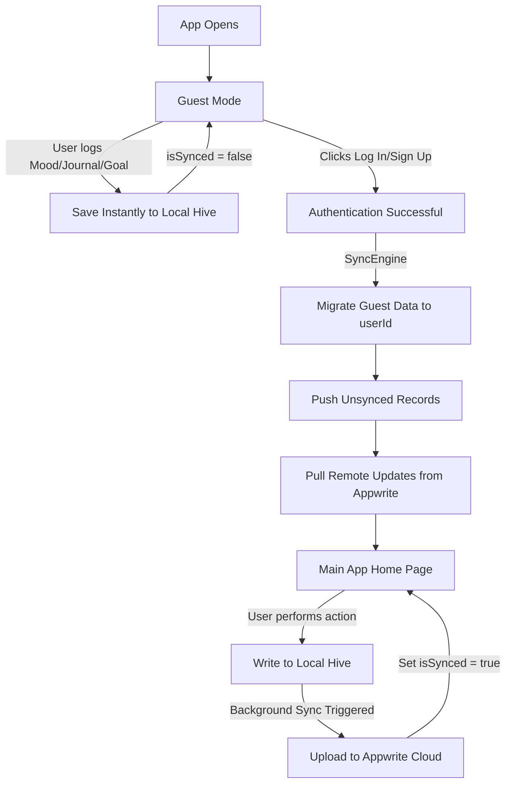
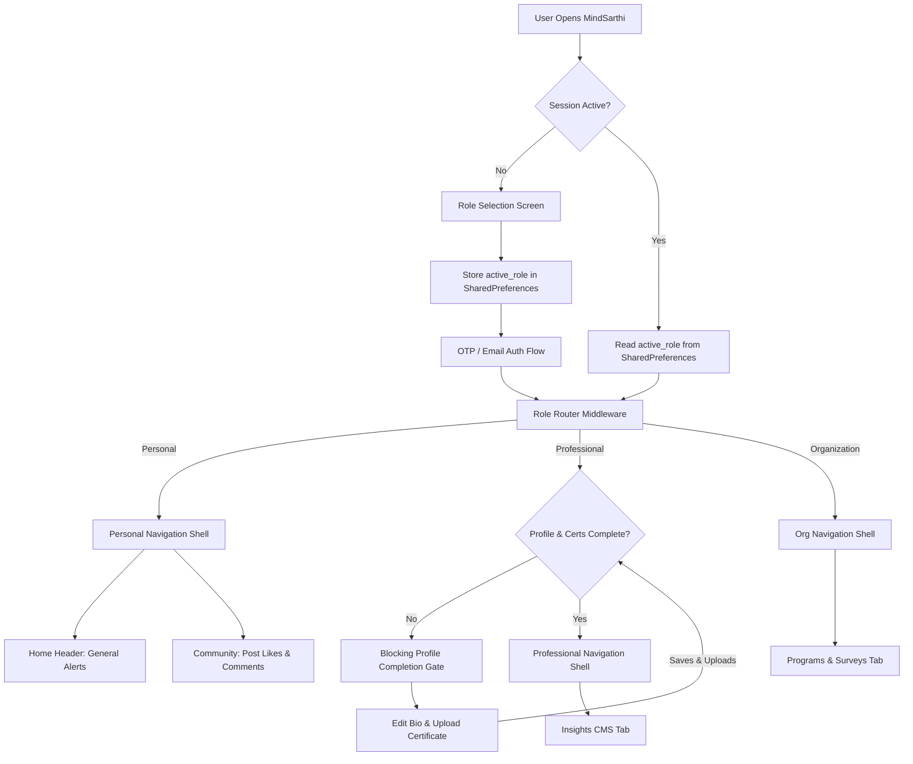

<div align="center">


[](https://git.io/typing-svg)

<br/>

[](https://flutter.dev)
[](https://appwrite.io)
[](https://hivedb.dev)
[](https://ai.google.dev)
[](LICENSE)

> *Secure, offline-first, and empathetic mental health support tailored for Individuals, verified Professionals, and Organizations* 💚

</div>

---

## 📋 Table of Contents

- [🧠 The Vision & Paradigm Shift](#-the-vision--paradigm-shift)
  - [Why Appwrite + Local-First Hive?](#why-appwrite--local-first-hive)
- [✨ Premium Core Features](#-premium-core-features)
- [🗺️ Technical Architecture](#%EF%B8%8F-technical-architecture)
  - [Local-First Sync State Machine](#local-first-sync-state-machine)
  - [Application Flow & Role Router](#application-flow--role-router)
- [🛠️ Tech Stack](#%EF%B8%8F-tech-stack)
- [📂 Folder Structure](#-folder-structure)
- [🚀 Getting Started](#-getting-started)
  - [Database & Storage Auto-Initialization](#database--storage-auto-initialization)
- [🛡️ Security & Quality Standards](#%EF%B8%8F-security--quality-standards)
- [👥 The Ctrl Freaks Team](#-the-ctrl-freaks-team)

---

## 🧠 The Vision & Paradigm Shift

**MindSarthi** is a premium, secure mental wellness ecosystem bridging the gap between individuals seeking help, therapists managing clients, and organizations supporting employee mental health. 

### Why Appwrite + Local-First Hive?

Initially modeled around Firebase, we completely overhauled MindSarthi’s database architecture to a **Local-First (Offline-First)** design by pairing **Hive** with **Appwrite**. 

> [!NOTE]
> **The Clinical Rationale for Local-First:**
> In mental health apps, connectivity should never gate access to care. If a user is experiencing an emotional crisis, recording a journal, tracking a daily goal, or logging their mood, a poor network connection must not cause latency, spin-locks, or failures.

By shifting to a Local-First architecture, the app gains three massive clinical and technical benefits:
1. **Instant UI Response:** Every write operation (Journals, Moods, Tasks, Chat Histories) is committed to Hive locally in under **10ms**, rendering immediately.
2. **Background Reconciliation:** A dedicated `SyncService` queues unsynced local modifications and dispatches them to Appwrite when connectivity is available, keeping local and cloud states in perfect sync.
3. **Guest Data Migration:** Guest users can use all journaling and goal-tracking features immediately. Upon signing up or logging in, the sync engine retroactively binds the guest data to their new Appwrite `userId` and runs an initial sync, ensuring zero data loss.

---

## ✨ Premium Core Features

### 👤 Personal User Experience
*   **😌 Premium Mood Tracker:** Dynamic emotional trending cards with interactive inputs.
*   **📝 Visual Markdown Journaling:** Standard formatting tools (Bold, Italic, Headers, Underline, Bullet Lists) rendering inline *as you type*, backed by an interactive formatting cheat sheet.
*   **🎯 Streaks & Goal Milestones:** Real-time streak tracking (`🔥 X-day streak`) dynamically compiled from distinct journal entries to prevent double-counting. Includes animated milestone celebrations (7, 14, 30 days) and streak-break warnings.
*   **🚨 Panic SOS Assist:** A highly visual crisis intervention card instantly providing mock emergency connections and localized support resources.
*   **🤖 ChatPal AI Companion:** Warm, empathetic mental health guidance powered by Google Gemini, running sentiment score analysis to flag depression.

### 👨‍⚕️ Professional User Experience
*   **🔐 Shared Auth, Divided Spaces:** Login with the same email as your personal account, with the router separating your databases and roles cleanly.
*   **🛡️ Mandatory Verification Gate:** A strict verification middleware locks core features (Insights CMS and Counselling Listings) until the professional uploads degree certificates (PDF/Images) to the Appwrite `certificates_bucket` and completes their profile.
*   **📊 Client & Session Dashboards:** Grouped sessions (Upcoming, Completed, Cancelled) and stateful client searches displaying historical reports and session records.
*   **✍️ Insight CMS:** Publish professional, expert-curated wellness articles directly to the personal user feed.

### 🏢 Organizational User Experience
*   **📈 Wellness Dashboard:** Displays organizational health trends, average team wellness scores, and interactive wellness heatmaps.
*   **anonymous Reports Stream:** Secure portal for employees to post anonymous workplace climate complaints, allowing HR managers to mark them as resolved.
*   **📋 Survey Builder & Custom Analytics:** Create custom multiple-choice scale and text questions. Answers are analyzed in a premium results page with custom-painted bar charts.
*   **✉️ Bulk Invites & CSV Parser:** Invite entire team rosters in seconds using manual comma-separated text or uploading CSV files.

---

## 🗺️ Technical Architecture

### Local-First Sync State Machine



### Application Flow & Role Router



---

## 🛠️ Tech Stack

<div align="center">

| Layer | Technology | Purpose |
|:---:|:---:|:---|
| **Frontend** | **Flutter (3.x)** | Clean, responsive multiplatform client codebase |
| **State Management** | **Flutter Riverpod** | Reactive state bindings and decoupled auth states |
| **Local Cache** | **Hive DB** | Fast, binary key-value storage for offline durability |
| **Backend & Cloud** | **Appwrite** | Cloud DB, Document Storage, Auth & Realtime synchronization |
| **AI Capabilities** | **Google Gemini** | ChatPal natural language processing & sentiment logging |
| **Aesthetics** | **Custom Styling** | "Healing Teal" and "Warm Coral" design tokens with built-in dark modes |

</div>

---

## 📂 Folder Structure

```
/lib
  /core
    /constants       → Appwrite constants (collections, buckets, database IDs)
    /services        → SyncService, NotificationService, AppwriteService
    /theme           → Theme provider, custom Healing Teal palette, Toastification alerts
    /widgets         → Role router, custom markdown editing controller
  /features
    /auth            → Shared repository & login triggers
    /user_selector   → Dynamic role selection & SharedPreferences persistence
    /personal_user   → Client module: journals, mood inputs, goals, AI ChatPal, SOS, community
    /professional_user → Therapist module: sessions, client tracking, certificates upload, CMS
    /organizational_user → Enterprise module: wellness heatmaps, survey dashboards, bulk CSV invites
```

---

## 🚀 Getting Started

### Prerequisites
*   [Flutter SDK](https://docs.flutter.dev/get-started/install) installed locally.
*   An active [Appwrite Console](https://appwrite.io/) instance or local docker deploy.
*   A Google Gemini API key from [Google AI Studio](https://aistudio.google.com/).

### Setup
1.  **Clone the Project:**
    ```bash
    git clone https://github.com/TeamCtrlFreaks/MindSarthi.git
    cd MindSarthi
    ```
2.  **Install Dependencies:**
    ```bash
    flutter pub get
    ```

### Database & Storage Auto-Initialization
We supply a database schema config script that automatically initializes all Appwrite collections, schema attributes, document indexes, and the storage bucket for certificates.

3.  **Run the Schema Setup Script:**
    Open PowerShell in the project directory and execute:
    ```powershell
    ./setup_schema.ps1
    ```
    *(Ensure you provide your Appwrite Endpoint, Project ID, and API Secret key inside the prompts or as environment variables).*

4.  **Register Hive Adapters:**
    Compile the localized database serialization adapters:
    ```bash
    flutter pub run build_runner build --delete-conflicting-outputs
    ```

5.  **Launch MindSarthi:**
    ```bash
    flutter run
    ```

---

## 🛡️ Security & Quality Standards

*   **Zero Secrets Committed:** All sensitive configurations, Firebase/Appwrite keys, and private API keys are decoupled from compile binaries and managed through `secrets.json` and environmental parameters.
*   **Safe Code Guidelines:** Graced with zero compiler errors. Clean lint standards applied via `flutter analyze`.
*   **Granular Privacy Toggles:** Organizational reports, moods, and surveys are strictly anonymized, ensuring employee safety. Personal notification triggers respect strict, user-configurable toggles cached in local Hive preferences.

---

## 👥 The Ctrl Freaks Team

<div align="center">

| [<br/><sub><b>Geetish Mahato</b></sub>](https://github.com/GeetishM) | [<br/><sub><b>Anamika Dey</b></sub>](https://github.com/anamikadey099) | [<br/><sub><b>Pragya Kumar</b></sub>](https://github.com/Pragya-Kumar) |
|:---:|:---:|:---:|

*Crafted with 💜. Remember: Mental health matters, and you are never alone. If MindSarthi resonates with you, please consider giving it a ⭐!*

</div>
